# Laporan Praktikum P2: Transfer Learning dan Fine-Tuning ResNet-18

**Mata Kuliah** : RET503 Computer Vision and Deep Learning (Pertemuan 3)
**Program Studi** : D4 Teknologi Rekayasa Robotika, Jurusan Teknik Elektro, Politeknik Negeri Batam
**Anggota** : Raja Muhammad Aidilsyah (4222411030),

---

## 1. Tujuan

Praktikum ini bertujuan untuk:

1. membandingkan tiga pendekatan pelatihan ResNet-18, yaitu *feature extraction*, fine-tuning parsial, dan pelatihan dari nol (*scratch*), pada dataset citra komponen elektronik yang diambil dari kamera robot;
2. mengukur latensi ResNet-18 dan MobileNetV3-Small terhadap anggaran inferensi 35 ms pada target 15 FPS; dan
3. menyusun dataset awal serta dokumen desain pipeline persepsi untuk proyek RET501 (CDIO Stage #2 Design).

## 2. Dasar Teori

*Transfer learning* adalah pemanfaatan kembali pengetahuan dari domain sumber (misalnya ImageNet) untuk menyelesaikan tugas pada domain target yang datanya jauh lebih sedikit. Pemanfaatan ini dimungkinkan karena lapisan awal CNN mempelajari fitur umum seperti tepi, warna, dan gradien, sedangkan lapisan yang lebih dalam mempelajari fitur yang semakin spesifik terhadap domain sumber [2], [3]. Dengan demikian, lapisan awal dapat dipakai ulang, sedangkan lapisan akhir perlu disesuaikan.

ResNet-18 merupakan arsitektur residual network berkedalaman 18 lapisan yang memakai koneksi pintas (*skip connection*) untuk memudahkan pelatihan jaringan dalam [1]. Pada torchvision, model ini tersedia dengan bobot pretrained ImageNet (`IMAGENET1K_V1`) [4]. Tiga strategi yang diuji pada praktikum ini adalah:

- ***feature extraction***: seluruh backbone dibekukan dan hanya lapisan `fc` yang baru dilatih;
- **fine-tuning parsial**: blok `layer4` dan `fc` dilatih, sedangkan lapisan sebelumnya dibekukan; dan
- ***scratch***: seluruh model diinisialisasi acak dan dilatih penuh sebagai pembanding.

## 3. Alat dan Bahan

| Komponen | Spesifikasi |
|---|---|
| Sistem operasi | Windows |
| Bahasa dan pustaka | Python 3.11, PyTorch 2.14.1 (CPU), torchvision 0.29.1, OpenCV, Matplotlib |
| Perangkat komputasi | CPU (GPU tidak digunakan) |
| Model | ResNet-18 (bobot ImageNet `IMAGENET1K_V1`), MobileNetV3-Small (hanya untuk uji latensi) |
| Data | 604 citra, 5 kelas, diambil di laboratorium pada dua kondisi cahaya |

## 4. Langkah Kerja

1. **Persiapan lingkungan.** Lingkungan virtual dibuat dengan `python -m venv venv`, diaktifkan dengan `venv\Scripts\activate`, kemudian pustaka dipasang dengan `python -m pip install torch torchvision` dan `python -m pip install -r requirements.txt`.
1. **Persiapan lingkungan.** Lingkungan virtual dibuat dengan `python -m venv venv`, diaktifkan dengan `venv\Scripts\activate`, kemudian pustaka dipasang dengan `python -m pip install torch torchvision` dan `python -m pip install -r requirements.txt`.
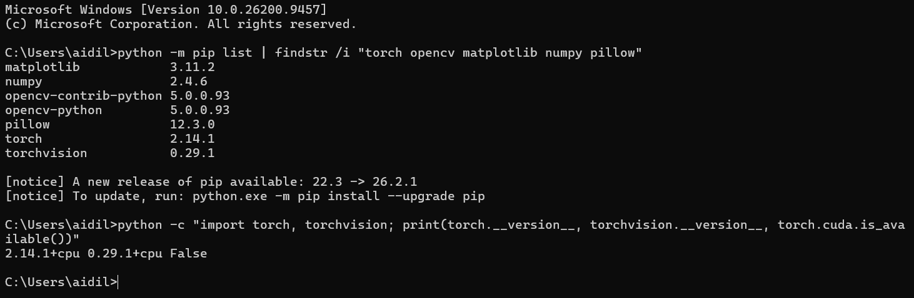
   [Gambar 4.1 Keluaran terminal instalasi pustaka dan pengecekan versi torch]

2. **Pengambilan data.** Citra diambil dari kamera robot untuk lima kelas (`arduino_uno`, `esp32`, `kartu_rfid`, `kosong`, `rfid_rc522`) pada dua kondisi cahaya (`lab_terang` dan `lab_redup`).
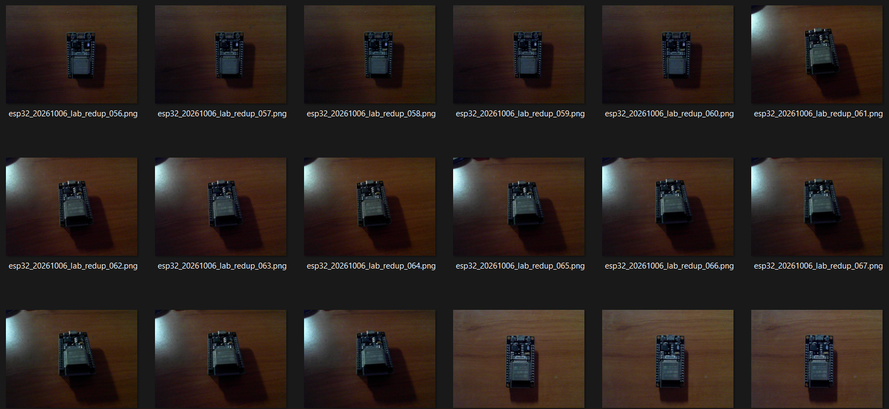
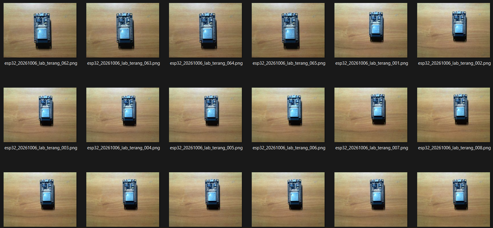

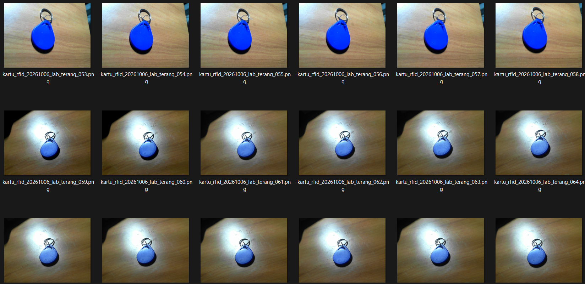
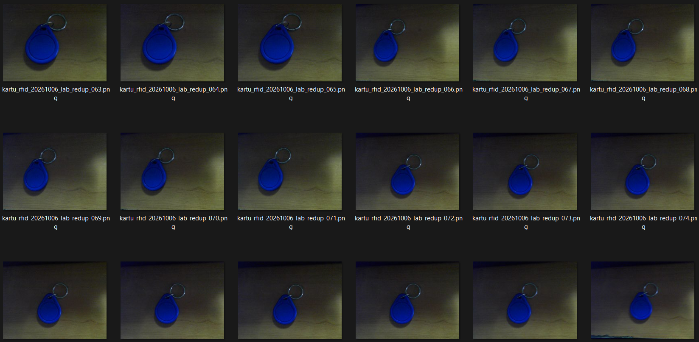

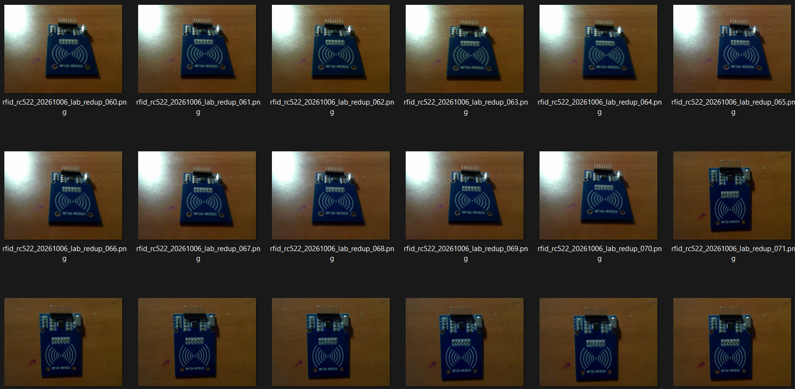
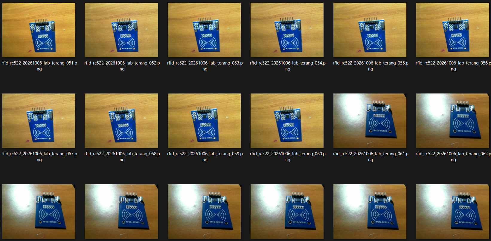

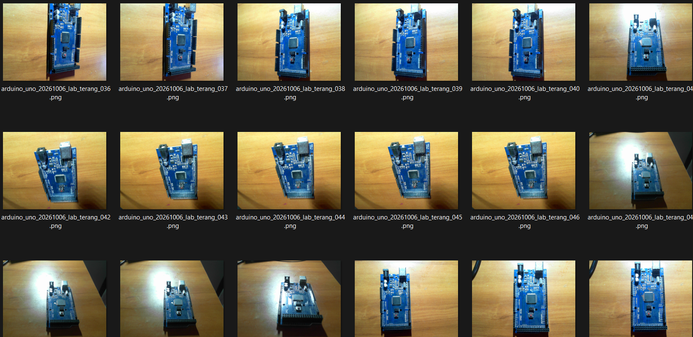
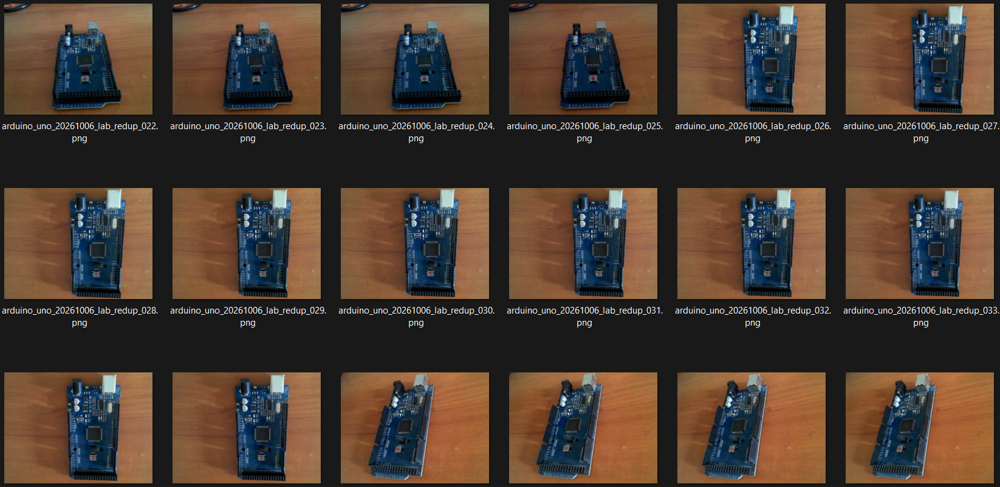
   [Gambar 4.2 Contoh citra setiap kelas pada kondisi terang dan redup]

3. **Penyusunan metadata.** Perintah `python make_metadata.py dataset_raw` menyusun `metadata.csv` (kolom `nama_file`, `kelas`, `tanggal`, `kondisi_cahaya`) dari nama berkas.
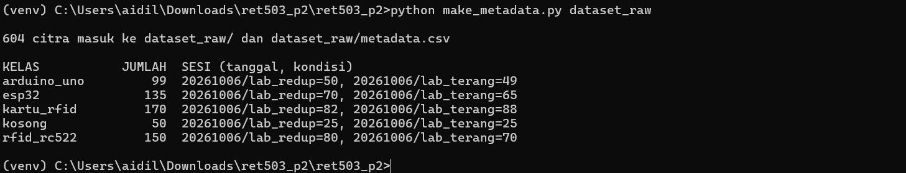
   [Gambar 4.3 Keluaran terminal make_metadata.py]

4. **Pembagian data.** Perintah `python split.py` membagi data berdasarkan sesi kondisi cahaya: seluruh citra `lab_terang` menjadi data latih dan seluruh citra `lab_redup` menjadi data validasi untuk semua kelas.
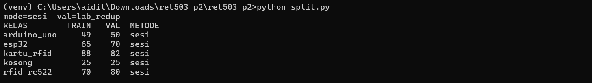
   [Gambar 4.4 Keluaran terminal split.py]

5. **Pelatihan tiga mode.** Perintah `python train.py feature`, `python train.py partial`, dan `python train.py scratch` dijalankan berurutan. Konfigurasi pelatihan: 10 epoch, ukuran batch 16, optimizer Adam, penjadwal CosineAnnealingLR, dan augmentasi data latih berupa RandomResizedCrop, HorizontalFlip, serta ColorJitter. Input dinormalisasi dengan mean (0,485; 0,456; 0,406) dan standar deviasi (0,229; 0,224; 0,225).
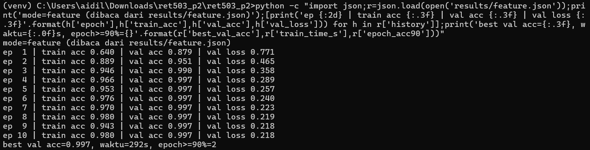
   [Gambar 4.5 Keluaran terminal pelatihan mode feature]
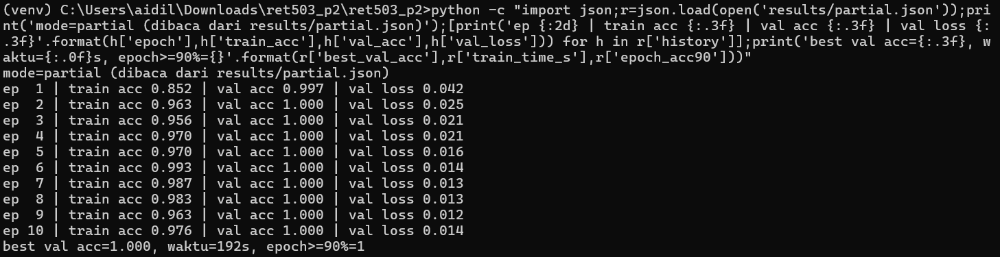
   [Gambar 4.6 Keluaran terminal pelatihan mode partial]
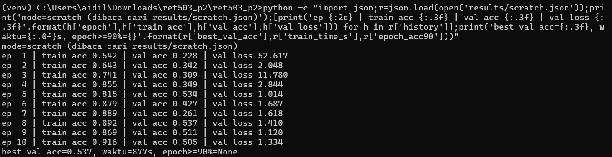
   [Gambar 4.7 Keluaran terminal pelatihan mode scratch]

6. **Rekap hasil.** Perintah `python report.py` menghasilkan `results/tabel_hasil.md` dan `results/grafik_akurasi.png`.
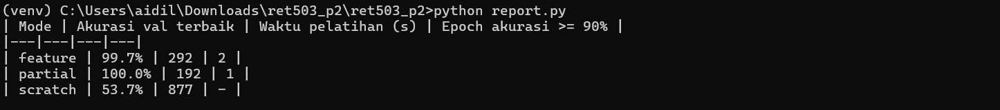
   [Gambar 4.8 Keluaran terminal report.py]

7. **Pengukuran latensi.** Perintah `python latency.py 5` mengukur waktu inferensi dan waktu pipeline (praproses + inferensi) sebanyak 100 pengulangan setelah 20 pemanasan, menggunakan frame sintetis 640×480.
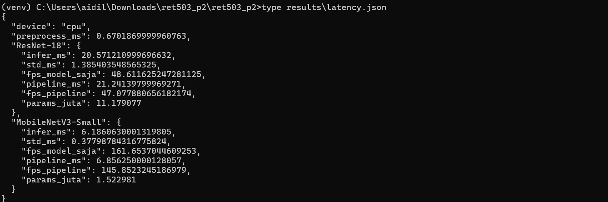
   [Gambar 4.9 Keluaran terminal latency.py]

## 5. Dataset

Dataset terdiri atas 604 citra dengan pembagian sebagai berikut.

**Tabel 5.1** Komposisi dataset per kelas

| Kelas | Total | Latih (`lab_terang`) | Validasi (`lab_redup`) |
|---|---|---|---|
| arduino_uno | 99 | 49 | 50 |
| esp32 | 135 | 65 | 70 |
| kartu_rfid | 170 | 88 | 82 |
| kosong | 50 | 25 | 25 |
| rfid_rc522 | 150 | 70 | 80 |
| **Total** | **604** | **297** | **307** |

## 6. Hasil

### 6.1 Perbandingan tiga mode pelatihan

**Tabel 6.1** Hasil pelatihan ResNet-18 (10 epoch, CPU)

| Mode | Bobot awal | Yang dilatih | Learning rate | Akurasi val terbaik | Waktu pelatihan (s) | Epoch pertama akurasi ≥ 90% |
|---|---|---|---|---|---|---|
| feature | ImageNet | `fc` | 1e-3 | 99,7% | 292 | 2 |
| partial | ImageNet | `layer4` + `fc` | 1e-4 / 1e-3 | 100,0% | 192 | 1 |
| scratch | Acak | Semua | 1e-3 | 53,7% | 877 | tidak tercapai |

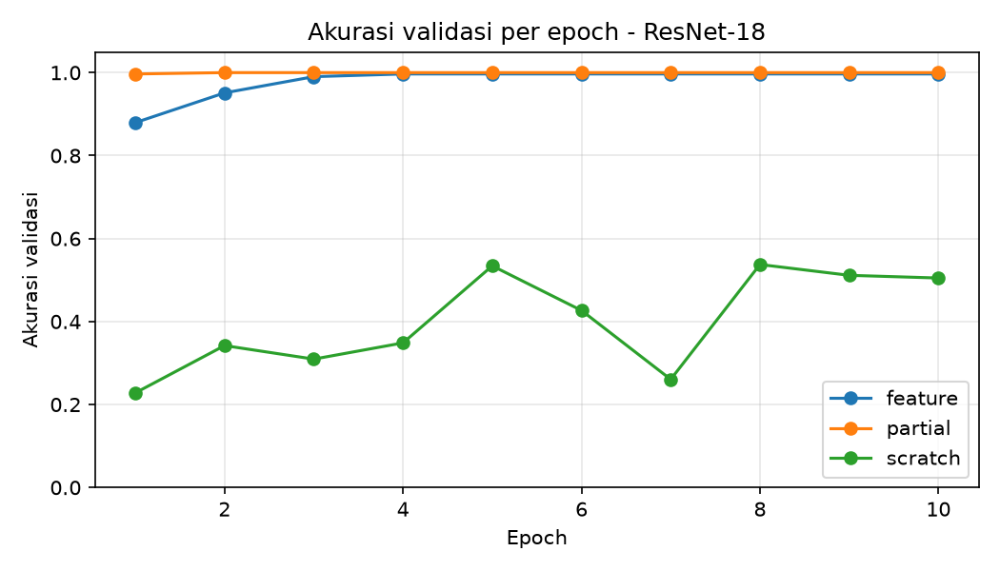
[Gambar 6.1 Grafik akurasi validasi per epoch untuk tiga mode pelatihan]

### 6.2 Latensi

**Tabel 6.2** Latensi pada CPU (100 pengulangan, input 224×224)

| Model | Inferensi (ms) | Pipeline (ms) | FPS pipeline | Anggaran inferensi 35 ms |
|---|---|---|---|---|
| ResNet-18 | 20,57 ± 1,39 | 21,24 | 47,1 | Terpenuhi |
| MobileNetV3-Small | 6,19 ± 0,38 | 6,86 | 145,9 | Terpenuhi |

## 7. Analisis

**Perbandingan tiga pendekatan.** Hipotesis awal praktikum adalah: [tempelkan isi hipotesis.txt dan sesuaikan kalimat berikut dengannya]. Hasil percobaan menunjukkan bahwa kedua mode yang memanfaatkan bobot pretrained memberikan akurasi validasi yang sangat tinggi, yaitu 99,7% untuk *feature extraction* dan 100,0% untuk fine-tuning parsial, sedangkan pelatihan dari nol hanya mencapai 53,7%. Akurasi *scratch* tersebut memang berada di atas tingkat tebakan kelas mayoritas (82 dari 307 citra validasi, atau sekitar 26,7%), tetapi jauh dari target 90%. Selisih yang besar ini sejalan dengan konsep transfer learning, yaitu bahwa fitur umum hasil pelatihan ImageNet sudah memadai untuk membedakan kelima komponen, sehingga hanya lapisan klasifikasi (dan sebagian `layer4`) yang perlu disesuaikan. Fine-tuning parsial mencapai akurasi di atas 90% sejak epoch pertama, sedangkan *feature extraction* membutuhkan dua epoch. Selisih 99,7% terhadap 100,0% setara dengan satu citra dari 307 citra validasi, sehingga perbedaan kedua mode ini tidak cukup kuat untuk menyatakan salah satunya lebih unggul.

Rendahnya akurasi *scratch* diduga disebabkan oleh beberapa faktor yang bekerja bersamaan: sekitar 11 juta parameter yang diinisialisasi acak harus dipelajari dari hanya 297 citra latih, jumlah epoch yang terbatas (10 epoch dengan learning rate yang menurun mengikuti cosine annealing), dan data latih yang hanya mencakup satu kondisi cahaya sementara data validasi berada pada kondisi cahaya yang berbeda. Fitur yang dipelajari dari data sekecil itu cenderung kurang tahan terhadap perubahan pencahayaan dibandingkan fitur pretrained. Dugaan ini belum diuji secara terpisah pada praktikum ini.

**Waktu pelatihan.** Mode *scratch* membutuhkan 877 s, atau sekitar 3 hingga 4,6 kali lebih lama daripada mode lainnya. Hal ini sesuai dengan teori karena pada *scratch* seluruh parameter memerlukan perhitungan gradien, sedangkan pada *feature extraction* hanya 2.565 parameter (lapisan `fc`) yang dilatih dan pada fine-tuning parsial hanya `layer4` (sekitar 8,4 juta parameter) beserta `fc`. Namun, waktu *feature extraction* (292 s) tercatat lebih lama daripada fine-tuning parsial (192 s), padahal secara teoritis mode tersebut lebih ringan karena propagasi balik tidak melewati backbone. Selisih ini diduga berasal dari faktor lingkungan, antara lain pembacaan citra dari disk yang pertama kali (belum tersimpan di cache sistem) dan beban proses lain pada komputer. Oleh karena itu, perbandingan waktu antara *feature* dan *partial* tidak dapat disimpulkan secara tegas; perbandingan yang kuat hanya berlaku terhadap *scratch*.

**Validitas pembagian data dan data leakage.** Pembagian data dilakukan per sesi kondisi cahaya, sehingga citra beruntun dari posisi yang hampir sama tidak muncul pada data latih dan data validasi sekaligus. Pada percobaan awal, sesi validasi dipilih secara acak untuk masing-masing kelas, sehingga sebagian kelas hanya memiliki citra terang pada data latih sedangkan kelas lain hanya memiliki citra redup. Konfigurasi itu berisiko membuat model menebak kelas dari tingkat kecerahan (*shortcut learning*) dan karenanya dikoreksi: kondisi `lab_redup` ditetapkan sebagai data validasi untuk seluruh kelas dan seluruh hasil pada laporan ini diperoleh dari pembagian yang telah dikoreksi tersebut. Dengan konfigurasi ini, akurasi validasi menggambarkan kemampuan model menghadapi perubahan pencahayaan, bukan kemampuan menghafal frame.

**Kelayakan latensi.** ResNet-18 memerlukan 20,57 ms untuk inferensi, atau sekitar 59% dari anggaran inferensi 35 ms, dan waktu praproses sekitar 0,67 ms. Dengan demikian, kandidat ini memenuhi anggaran pada perangkat uji dengan margin sekitar 14 ms. MobileNetV3-Small jauh lebih cepat (6,19 ms) dan juga memenuhi anggaran. Pengukuran dilakukan pada CPU komputer praktikum, bukan pada unit komputasi robot, serta tidak mencakup akuisisi kamera, komunikasi ROS 2, dan pascaproses yang turut dihitung dalam anggaran total 67 ms. Akurasi MobileNetV3-Small pada dataset ini belum dievaluasi karena model tersebut hanya diukur latensinya. Oleh karena itu, pemilihan model akhir bergantung pada pengukuran ulang di perangkat target.

**Keterbatasan percobaan.**

1. Akurasi validasi yang mendekati 100% menunjukkan bahwa tugas klasifikasi lima komponen pada latar dan kamera yang seragam tergolong mudah bagi fitur pretrained. Hasil ini belum menjamin kinerja pada lingkungan, latar, atau sudut pandang yang berbeda dari data pengambilan.
2. Akurasi terbaik dipilih berdasarkan data validasi yang sama tanpa set uji terpisah, sehingga nilai yang dilaporkan cenderung sedikit optimistis.
3. Data kelas `kosong` hanya berjumlah 50 citra sehingga lebih sedikit dibandingkan kelas lain, dan dataset hanya mencakup dua kondisi cahaya pada satu tanggal pengambilan.
4. Setiap mode hanya dijalankan satu kali tanpa pengulangan dengan seed berbeda, sehingga variasi antarpelatihan belum diketahui.

## 8. Kesimpulan

1. Pada 297 citra latih, ResNet-18 yang memanfaatkan bobot pretrained ImageNet mencapai akurasi validasi 99,7% (*feature extraction*) dan 100,0% (fine-tuning parsial), sedangkan pelatihan dari nol hanya mencapai 53,7%. Transfer learning terbukti jauh lebih efektif untuk dataset berukuran kecil ini.
2. Fine-tuning parsial mencapai akurasi di atas 90% pada epoch pertama dan *feature extraction* pada epoch kedua. Selisih akurasi keduanya hanya satu citra validasi sehingga tidak cukup untuk menyatakan salah satunya lebih unggul. *Feature extraction* melatih jauh lebih sedikit parameter (2.565 parameter).
3. Pelatihan dari nol memerlukan waktu 877 s, sekitar 3 hingga 4,6 kali lebih lama daripada mode lain, dengan akurasi yang paling rendah.
4. ResNet-18 memerlukan 20,57 ms per inferensi pada CPU dan memenuhi anggaran 35 ms, demikian pula MobileNetV3-Small (6,19 ms). Pengukuran pada unit komputasi robot masih diperlukan untuk menetapkan model akhir.
5. Pembagian data per sesi dengan kondisi validasi yang konsisten pada semua kelas menghasilkan evaluasi yang menguji ketahanan terhadap perubahan cahaya, namun belum menguji perubahan latar atau sudut pandang.

## Daftar Pustaka

[1] K. He, X. Zhang, S. Ren, and J. Sun, "Deep residual learning for image recognition," in *Proc. IEEE Conf. Comput. Vis. Pattern Recognit. (CVPR)*, 2016, pp. 770–778.

[2] J. Yosinski, J. Clune, Y. Bengio, and H. Lipson, "How transferable are features in deep neural networks?" in *Adv. Neural Inf. Process. Syst. (NeurIPS)*, vol. 27, 2014.

[3] M. D. Zeiler and R. Fergus, "Visualizing and understanding convolutional networks," in *Proc. Eur. Conf. Comput. Vis. (ECCV)*, 2014, pp. 818–833.

[4] PyTorch, "torchvision.models," *PyTorch Documentation*. [Online]. Available: https://pytorch.org/vision/stable/models.html
